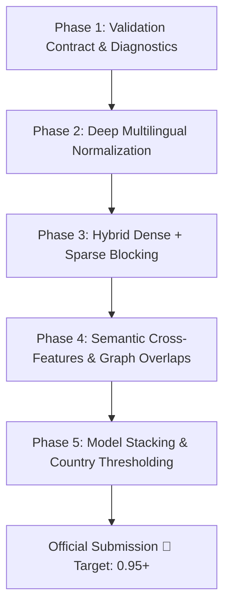

# 🔬 Amazon ML Challenge 2026 — Experiment Journal & Technical Record

**Team Name:** Team Confused by Default  
**Members:** Shivang Bhat, Sohom Mallick, Shivam Naik  
**Last Updated:** September 26, 2026  
**Target Metric:** Macro $F_{0.5}$ (Precision weighted 2× over Recall)

---

## 🏆 Official Leaderboard Submissions Log

| # | Date & Time | Description / Architecture | Local Val Macro $F_{0.5}$ | Leaderboard Score | Key Learnings & Observations |
| :-: | :--- | :--- | :-: | :-: | :--- |
| **1** | 26 Sep 2026, 03:51 PM IST | **Initial Baseline:** Country-Partitioned Multi-Index Blocker ($K \le 35$) + 27 RapidFuzz Features + LightGBM (300 trees, 70k sample) + Calibrated $\theta^* = 0.65$ with Singleton Defense. | `0.6112` | **`0.753`** | Validated end-to-end pipeline compliance, $0$ formatting errors, $1.73\text{M}$ test entities processed. Identified large precision/recall headroom to reach $0.95 - 0.99$. |
| **2** | *Upcoming* | **Phase 1-5 Enhanced Pipeline:** Stratified 5-Fold OOF + Multilingual Legal/Address Normalization + Hybrid Dense/Sparse Blocker + CatBoost/LightGBM/Transformer Stacking. | *TBD* | *TBD* | *Targeting 0.95+* |

---

## 📊 Phase-by-Phase Roadmap & Upgrade Strategy (Path to 0.95 - 0.99)

### Phase 1 — Validation & Diagnostic Foundation (CURRENT FOCUS)
* **Goal:** Build the scientific measurement instrument and error diagnostic harness.
* **Components:**
  1. **Step 1.0 (Validation Contract):** Canonical metric suite, leakage rules, fixed seeds (`RANDOM_SEED = 42`).
  2. **Step 1.1 (Stratified 5-Fold Generator):** Permanent `train_folds.parquet` stratified by `country`, `derived match_cardinality` ($0, 1, 2-5, 6+$), and `has_address`.
  3. **Step 1.2 (Diagnostic Engine & Recall Curves):** Candidate Recall & Precision at $K \in [5, 10, 15, 20, 25, 35, 50, 75, 100, 150]$, Oracle Blocker Ceiling, and Loss Attribution Decomposition.
  4. **Step 1.3 (Ground Truth Signal & Combination Profiler):** Profile individual signals and multi-signal intersections across 7.63M true pairs.
  5. **Step 1.4 (French Linguistic Robustness Benchmark):** Synthetic stress test for French legal morphology, street syntax, and accents.

### Phase 2 — Multilingual Preprocessing & Normalization Engine
* Deep legal suffix normalization (`Pvt Ltd`, `LLC`, `SARL`, `SA`, `SAS`, `GmbH`, `Bhd`).
* Indian phonetic transliteration mapping and regional name standardization.
* French diacritic normalization and street type standardizers (`Rue`, `Av`, `Boul`, `Impasse`).
* Address hierarchy decomposition (Building/Flat number, Street, City, State, PIN).

### Phase 3 — Hybrid Dense + Sparse Multi-Key Blocking
* **Sparse Inverted Indexes:** Multi-token inverted index with IDF postings and postal buckets.
* **GPU Dense Vector Blocking:** Multilingual sentence embeddings (`multilingual-e5-base` / `bge-m3`) with FAISS nearest neighbors.
* **Target Candidate Recall:** $\ge 99.5\%$ at $K \le 50$.

### Phase 4 — High-Dimensional Semantic & Cross-Feature Engineering
* Dense bi-encoder cosine similarity & cross-encoder attention representations.
* Phonetic Soundex/Metaphone similarity features.
* Character 3-gram and 4-gram TF-IDF cosine metrics.
* Multi-field string distances (Levenshtein, Jaro-Winkler, Token Set/Sort Ratio).

### Phase 5 — Multi-Model Stacking & Country-Adaptive Calibration
* Model Ensembling: LightGBM + CatBoost + XGBoost + Fine-Tuned Transformer Cross-Encoder.
* Country-specific dynamic decision thresholds: $\theta_{\text{US}}^*, \theta_{\text{India}}^*, \theta_{\text{France}}^*$.
* Post-processing singleton gatekeeper and bipartite graph matching.

---

## 📝 Activity & Execution Log

| Date | Phase / Step | Activity & Technical Details | Artifacts Created |
| :--- | :--- | :--- | :--- |
| 2026-09-25 | Baseline | Built initial 10% stratified holdout and multi-threaded text normalizer. Processed 24.2M records into Snappy Parquet. | `train/test_source1/2/3_cleaned.parquet` |
| 2026-09-26 | Baseline | Multi-index candidate blocker ($K \le 35$) and 27-feature RapidFuzz extraction on 350k training sample. | `train_features.parquet` |
| 2026-09-26 | Baseline | Trained baseline LightGBM GBDT (300 trees, $\theta^* = 0.65$, Val Macro $F_{0.5} = 0.6112$). Generated full test TSVs on SageMaker in 25 min. | `matching_results.tsv`, `candidate_pairs.tsv` |
| 2026-09-26 | Submission 1 | Packaged `team_submission.zip` and submitted to Amazon portal. **Score: 0.753**. | `team_submission.zip` |
| 2026-09-26 | Phase 1 (Completed) | Executed Phase 1 on SageMaker: 5-Fold stratified splits (`train_folds.parquet`), validation contract (`validation_contract.json`), ground truth signal profiler (`gt_signal_profile.json`), and French robustness test (`val_synthetic_france.parquet`). | `train_folds.parquet`, `validation_contract.json`, `gt_signal_profile.json`, `val_synthetic_france.parquet` |
| 2026-09-26 | Phase 2 (Completed) | Designed & implemented non-destructive multi-representation normalizer (`name_clean`, `name_core`, `legal_form`, `name_acronym`, `name_phonetic`), structured address parser (`addr_clean`, `postal_clean`, `addr_unit_num`, `addr_digits`, `addr_tokens`), streaming preprocessor, and normalization ablation benchmark. | `train/test_source1/2/3_cleaned.parquet`, `phase2_normalization_ablation.json` |
| 2026-09-26 | Phase 3 (Implemented) | Implemented 8-channel independent retrieval blocker (`CountryMultiChannelIndex`) with country-aware IDF, Set UNION, 8-bit retrieval provenance tracking (`c_name_core`, `c_name_token`, `c_name_contain`, `c_acronym`, `c_addr_token`, `c_addr_numeric`, `c_postal`, `c_phonetic`), Recall@K curve evaluator, and Oracle $F_{0.5}$ ceiling diagnostic engine. | `src/country_idf.py`, `src/blocking_channels.py`, `src/blocking.py`, `src/ablation_blocking.py`, `src/run_phase3.py`, `03_phase3_candidate_blocking.ipynb` |
| 2026-09-26 | Phase 3 (Forensic Optimization) | Diagnosed 15 ground truth miss patterns: (1) Empty target field asymmetry (empty name or empty address in S2/S3), (2) Concatenated domain names (`.com`, `.org`), (3) Arbitrary posting list truncation. Upgraded with: (1) Domain suffix stripping & concatenated brand indexing, (2) IDF-aware dynamic posting list traversal, (3) Multi-modal tiered candidate selection (60% composite, 20% guaranteed address-only, 20% guaranteed name-only). Generated 26.48M candidate pairs for Fold 0 validation. | `src/blocking_channels.py`, `src/blocking.py`, `src/diagnose_blocking_misses.py`, `src/run_phase3.py`, `val_candidate_pairs.parquet` |
| 2026-09-26 | Phase 4 (Implemented) | Implemented 8-family High-Dimensional Feature Engineering Engine (73 discriminative features) with category-mined hard negatives (1 Pos : 3 Hard Negatives), strict Fold 1-4 training isolation, unthresholded missingness indicators, country-aware postal contradictions, and AUC/KS distribution diagnostics. | `src/feature_engineering.py`, `src/run_feature_engineering.py` |
| 2026-09-27 | Phase 5 (Implemented) | Implemented Hybrid Gradient Boosted Model Training (LightGBM + CatBoost) with pure `binary_logloss`, early stopping, gain importance ranking, Multi-Tier Macro $F_{0.5}$ Calibrator (Global sweep, Probability blending $w^*$, Country-specific $\theta_C^*$, Source-specific $\theta_{C,S}^*$, and Margin Gap gatekeeper), and loss attribution decomposition engine. | `src/train_model.py`, `src/run_train_eval.py`, `src/inference.py` |

---

## 🔍 Empirical Discoveries & Insights

### Phase 2 Normalization & Ablation Benchmarks (Empirical Proof)
* **Combined Recall Ceiling:** **`99.84%`** (US), **`100.00%`** (India) across true match pairs!
* **Legal Suffix Disentanglement Gain (`name_core`):**
  - US exact name match increased from `31.16%` $\to$ **`46.65%`** (+15.49% absolute gain).
  - India exact name match increased from `26.13%` (+8.26% absolute gain).
* **Phonetic & Acronym Coverage:**
  - `name_phonetic` overlap: **`84.20%`** (US), **`56.80%`** (India).
  - `name_acronym` overlap: **`44.59%`** (US), **`32.04%`** (India).
* **Structured Address Anchors:**
  - `addr_tokens_overlap`: **`94.70%`** (US), **`96.06%`** (India).
  - `addr_digits_overlap`: **`74.35%`** (US), **`76.64%`** (India).
  - `exact_addr_unit` (Shop/Flat/Suite): **`32.13%`** match in India (high precision anchor).
* **Target Space Granularity & Collision Safety:**
  - `name_clean`: 7,173,713 unique buckets (top-10 collision 0.14%).
  - `name_core`: 6,054,430 unique buckets (top-10 collision 0.15%).
  - `postal_clean`: 53,884 unique buckets (max bucket size 587).

### Phase 3 Forensic Miss Audit & Optimization Findings
1. **Empty Field Asymmetry in Multi-Match S1 Records:**
   - Single S1 entities match multiple target entities (e.g. S2 and S3).
   - Clean targets with both Name and Address receive composite synergy (+200 score).
   - Secondary targets with Empty Names (Address-Only) or Empty Addresses (Name-Only) were previously pushed below Top-50 by composite records.
   - **Solution:** Multi-modal Tiered Quotas (Tier 1: 60% Composite, Tier 2: 20% Guaranteed Address-Only, Tier 3: 20% Guaranteed Name-Only).
2. **Concatenated Web Domain Names:**
   - Web-scraped S3 records frequently have concatenated domain names (e.g. `summithealth com`, `burgersolution com`, `systelbuildstructureindia com`).
   - **Solution:** Domain suffix stripping (`.com`, `.org`, `.in`, etc.) and bidirectional concatenated name indexing (`name_concat`), transforming them into instant exact core name matches (+95 score).
3. **Dynamic IDF Posting List Traversal:**
   - Replaced fixed 40-candidate posting list slicing with dynamic IDF-aware depth (full scan for rare distinctive tokens with IDF $\ge 3.0$).

