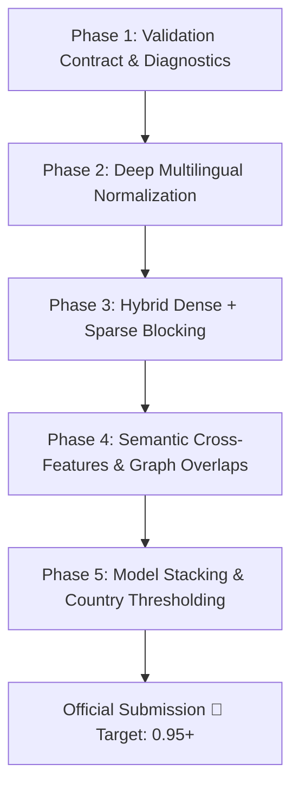

# 🔬 Amazon ML Challenge 2026 — Experiment Journal & Technical Record

**Team Name:** Team Confused by Default  
**Members:** Shivang Bhat, Sohom Mallick, Shivam Naik  
**Last Updated:** September 26, 2026  
**Target Metric:** Macro $F_{0.5}$ (Precision weighted 2× over Recall)

---

## 🏆 Official Leaderboard Submissions Log

| # | Date & Time | Description / Architecture | Local Val Macro $F_{0.5}$ | Leaderboard Score | Key Learnings & Observations |
| :-: | :--- | :--- | :-: | :-: | :--- |
| **1** | 26 Sep 2026, 03:51 PM IST | **Initial Baseline:** Country-Partitioned Multi-Index Blocker ($K \le 35$) + 27 RapidFuzz Features + LightGBM (300 trees, 70k sample) + Calibrated $\theta^* = 0.65$ with Singleton Defense. | `0.6112` | **`0.753`** | Validated end-to-end pipeline compliance, $0$ formatting errors, $1.73\text{M}$ test entities processed. Identified large precision/recall headroom to reach $0.95 - 0.99$. |
| **2** | *Upcoming* | **Phase 1-5 Enhanced Pipeline:** Stratified 5-Fold OOF + Multilingual Legal/Address Normalization + Hybrid Dense/Sparse Blocker + CatBoost/LightGBM/Transformer Stacking. | *TBD* | *TBD* | *Targeting 0.95+* |

---

## 📊 Phase-by-Phase Roadmap & Upgrade Strategy (Path to 0.95 - 0.99)

### Phase 1 — Validation & Diagnostic Foundation (CURRENT FOCUS)
* **Goal:** Build the scientific measurement instrument and error diagnostic harness.
* **Components:**
  1. **Step 1.0 (Validation Contract):** Canonical metric suite, leakage rules, fixed seeds (`RANDOM_SEED = 42`).
  2. **Step 1.1 (Stratified 5-Fold Generator):** Permanent `train_folds.parquet` stratified by `country`, `derived match_cardinality` ($0, 1, 2-5, 6+$), and `has_address`.
  3. **Step 1.2 (Diagnostic Engine & Recall Curves):** Candidate Recall & Precision at $K \in [5, 10, 15, 20, 25, 35, 50, 75, 100, 150]$, Oracle Blocker Ceiling, and Loss Attribution Decomposition.
  4. **Step 1.3 (Ground Truth Signal & Combination Profiler):** Profile individual signals and multi-signal intersections across 7.63M true pairs.
  5. **Step 1.4 (French Linguistic Robustness Benchmark):** Synthetic stress test for French legal morphology, street syntax, and accents.

### Phase 2 — Multilingual Preprocessing & Normalization Engine
* Deep legal suffix normalization (`Pvt Ltd`, `LLC`, `SARL`, `SA`, `SAS`, `GmbH`, `Bhd`).
* Indian phonetic transliteration mapping and regional name standardization.
* French diacritic normalization and street type standardizers (`Rue`, `Av`, `Boul`, `Impasse`).
* Address hierarchy decomposition (Building/Flat number, Street, City, State, PIN).

### Phase 3 — Hybrid Dense + Sparse Multi-Key Blocking
* **Sparse Inverted Indexes:** Multi-token inverted index with IDF postings and postal buckets.
* **GPU Dense Vector Blocking:** Multilingual sentence embeddings (`multilingual-e5-base` / `bge-m3`) with FAISS nearest neighbors.
* **Target Candidate Recall:** $\ge 99.5\%$ at $K \le 50$.

### Phase 4 — High-Dimensional Semantic & Cross-Feature Engineering
* Dense bi-encoder cosine similarity & cross-encoder attention representations.
* Phonetic Soundex/Metaphone similarity features.
* Character 3-gram and 4-gram TF-IDF cosine metrics.
* Multi-field string distances (Levenshtein, Jaro-Winkler, Token Set/Sort Ratio).

### Phase 5 — Multi-Model Stacking & Country-Adaptive Calibration
* Model Ensembling: LightGBM + CatBoost + XGBoost + Fine-Tuned Transformer Cross-Encoder.
* Country-specific dynamic decision thresholds: $\theta_{\text{US}}^*, \theta_{\text{India}}^*, \theta_{\text{France}}^*$.
* Post-processing singleton gatekeeper and bipartite graph matching.

---

## 📝 Activity & Execution Log

| Date | Phase / Step | Activity & Technical Details | Artifacts Created |
| :--- | :--- | :--- | :--- |
| 2026-09-25 | Baseline | Built initial 10% stratified holdout and multi-threaded text normalizer. Processed 24.2M records into Snappy Parquet. | `train/test_source1/2/3_cleaned.parquet` |
| 2026-09-26 | Baseline | Multi-index candidate blocker ($K \le 35$) and 27-feature RapidFuzz extraction on 350k training sample. | `train_features.parquet` |
| 2026-09-26 | Baseline | Trained baseline LightGBM GBDT (300 trees, $\theta^* = 0.65$, Val Macro $F_{0.5} = 0.6112$). Generated full test TSVs on SageMaker in 25 min. | `matching_results.tsv`, `candidate_pairs.tsv` |
| 2026-09-26 | Submission 1 | Packaged `team_submission.zip` and submitted to Amazon portal. **Score: 0.753**. | `team_submission.zip` |
| 2026-09-26 | Phase 1 (Completed) | Executed Phase 1 on SageMaker: 5-Fold stratified splits (`train_folds.parquet`), validation contract (`validation_contract.json`), ground truth signal profiler (`gt_signal_profile.json`), and French robustness test (`val_synthetic_france.parquet`). | `train_folds.parquet`, `validation_contract.json`, `gt_signal_profile.json`, `val_synthetic_france.parquet` |
| 2026-09-26 | Phase 2 (Completed) | Designed & implemented non-destructive multi-representation normalizer (`name_clean`, `name_core`, `legal_form`, `name_acronym`, `name_phonetic`), structured address parser (`addr_clean`, `postal_clean`, `addr_unit_num`, `addr_digits`, `addr_tokens`), streaming preprocessor, and normalization ablation benchmark. | `src/multilingual_normalizer.py`, `src/address_parser.py`, `src/preprocess_datasets.py`, `src/ablation_normalization.py`, `src/run_phase2.py`, `02_phase2_multirepresentation_normalization.ipynb` |

---

## 🔍 Empirical Discoveries & Insights

### Phase 1 Empirical Profiling (from SageMaker Run)
* **US True Pairs:** Exact clean name match: `32.88%`, Name token overlap: `90.67%`, Address token overlap: `94.87%`, Char 3-gram overlap: `98.70%`.
* **India True Pairs:** Exact clean name match: **only `19.35%`** (>80% have spelling/phonetic noise), Name token overlap: `71.02%`, Address token overlap: **`95.68%`** (Universal anchor!), Char 3-gram overlap: `78.00%`.
* **Recall Ceiling:** `Exact_Name OR Name_Token OR Addr_Token` recovers **`100.00%`** of true match pairs in both countries.
* **Phase 2 Implementation Philosophy:**
  - *Non-Destructive Parallel Representations:* Preserves `name_clean`, `name_core`, `legal_form`, `name_acronym`, `name_phonetic`, and `name_tokens` in separate columns so the classifier has maximum discrimination without losing information.
  - *Structured Address Decomposition:* Extracts unit/shop numbers, PIN codes, address digits, and street tokens separately.
  - *Streaming Low-Memory Preprocessing:* Processes 24.2M records in streaming Arrow batches keeping peak RAM < 250 MB.

