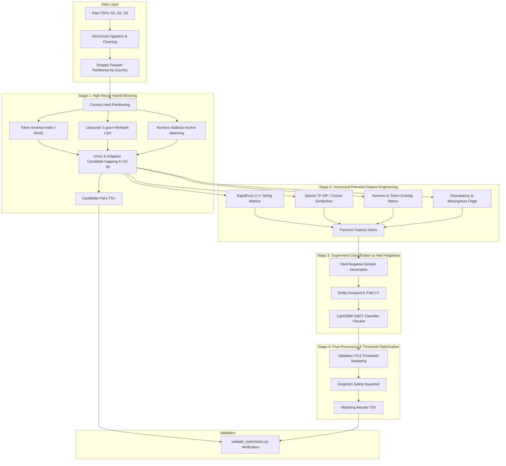

# Amazon ML Challenge 2026: Business Entity Resolution
## Final Solution Workflow & Production Architecture Blueprint

**Target Metric:** Macro-Averaged $F_{0.5}$ Score (Precision Weighted 2× over Recall)  
**Dataset Scale:** ~12.5M Training Records, ~11.7M Test Records across 3 Sources (`S1`, `S2`, `S3`)

---

## 1. Executive Summary & Objective

In this challenge, we must resolve duplicate and corresponding business entity records from two noisy target sources (**Source 2** and **Source 3**) against a deduplicated reference source (**Source 1**).

### Core Problem Formulations:
* **Reference Linkage:** Every entity in `test_source1.tsv` must appear in the final submission `matching_results.tsv`.
* **Cardinality:** An S1 entity may link to $0$ records (singleton), $1$ record, or $N$ records spanning S2 and S3.
* **The Optimization Metric ($F_{0.5}$):**
  $$F_{0.5} = \frac{(1 + 0.5^2) \cdot \text{Precision} \cdot \text{Recall}}{0.5^2 \cdot \text{Precision} + \text{Recall}} = \frac{1.25 \cdot P \cdot R}{0.25 \cdot P + R}$$
  * **Precision is weighted 2× over Recall.** A false match (merging two distinct entities) incurs a severe penalty.
  * **Singleton Precision:** Correctly predicting an empty match list for a true singleton scores **$1.0$**. Predicting any false candidate for a singleton drops that entity's score to **$0.0$**.
* **Zero-Shot Country Generalization:**
  * Training data contains only `US` (60%) and `India` (40%).
  * Test data contains `US` (38.3%), `India` (47.3%), and **`France` (14.4%)**.
  * **Strict Requirement:** No hardcoded country-specific lookup tables. All cleaning, blocking, and feature engineering must be statistical, invariant, and language-agnostic.
* **Strict Country Invariant:** 100% of true matches in ground truth are within the same country. Records are strictly partitioned by country.

---

## 2. End-to-End System Architecture



---

## 3. Phase-by-Phase Execution Plan: What We Are Doing & Why

### Phase 1: High-Speed Ingestion & Partitioned Storage
* **What We Do:**
  1. Parse all TSVs using Polars with explicit `\t` separator and sanitize line endings (`\r\n` $\to$ `\n`).
  2. Normalize the `country` string (strip whitespace, uppercase) and partition dataset into columnar Parquet files (`country=US`, `country=India`, `country=France`).
  3. Construct a stratified 10% validation holdout split from `train_source1.tsv` grouped strictly by entity ID.
* **Why We Do This:**
  * Re-reading ~24M rows of raw TSV text repeatedly is computationally intractable. Snappy-compressed Parquet reduces memory footprint by 70% and enables memory-mapped multi-threaded columnar reads.
  * Country partitioning reduces pairwise search space from $O(N \cdot M)$ to independent sub-problems without losing a single true match.

---

### Phase 2: Vectorized Text Normalization & Representation
* **What We Do:**
  1. **Unicode NFKC & Diacritic Stripping:** Normalize accents (e.g., `é` $\to$ `e`, `ô` $\to$ `o`) so French and Hindi transliterations map to standard alphanumeric forms.
  2. **Vectorized Punctuation Harmonization:** Standardize symbols (`&` $\to$ `and`, `@` $\to$ `at`), remove special symbols, collapse whitespace.
  3. **Data-Driven Token Weighting (IDF):** Rather than hardcoding finite legal suffix dictionaries (which fail on unseen French or international legal types), we fit TF-IDF vectorizers per country partition. Generic suffixes (`inc`, `llc`, `pvt ltd`, `sarl`, `sa`) receive low IDF weights naturally without brittle manual rules.
  4. **Entity Representation Extraction:**
     * Cleaned canonical name & address strings.
     * Character n-gram shingles (3-grams and 4-grams).
     * Exact digit token sets (door numbers, PIN/ZIP codes, street numbers).
* **Why We Do This:**
  * Avoids Python row-by-row iteration bottlenecks. Polars batch expressions and C-extensions process 10M rows in seconds rather than hours.
  * Zero-shot generalization is preserved: unseen words or suffixes in France are handled statistically without manual regex maintenance.

---

### Phase 3: High-Recall Hybrid Candidate Generation (Blocking)
* **What We Do:**
  Candidate generation determines the **theoretical recall ceiling** of the entire pipeline. We use a multi-pronged union strategy:
  1. **Inverted Token Index (BM25 / Sparse TF-IDF):** Fast retrieval of top matches based on distinctive name tokens.
  2. **Character 3-Gram MinHash LSH:** Captures typo-heavy and abbreviation variations that share sub-token character overlaps.
  3. **Address & Numeric Token Anchoring:** Pairs sharing exact street/PIN numbers combined with locality tokens are injected as high-precision candidates.
  4. **Adaptive Candidate Capping ($K = 20 \sim 30$):** Retain the top-$K$ candidates per S1 entity to constrain pairwise feature computation while preserving $\ge 97\%$ candidate recall.
  5. **Direct Output:** Save candidate pairs immediately into `candidate_pairs.tsv` to ensure exact correspondence with downstream inference.
* **Why We Do This:**
  * Pure MinHash misses inverted word orders; pure token overlap misses severe typos; pure embeddings can miss exact numeric street numbers. The union captures all noise patterns.
  * Keeping candidate set size compact ($\le 30$) allows ultra-fast pairwise feature calculation.

---

### Phase 4: Vectorized Pairwise Feature Engineering
* **What We Do:**
  For all surviving $(S1, S2/S3)$ candidate pairs, compute a comprehensive suite of domain-invariant similarity features:
  1. **Name Similarity Features (RapidFuzz C++):**
     * Jaro-Winkler similarity (rewards prefix alignment).
     * Levenshtein ratio & Token Sort ratio (robust against word reordering).
     * Token Set ratio (handles substrings and legal suffix additions).
     * Character 3-gram Jaccard similarity.
  2. **Address Similarity Features:**
     * Address token Jaccard similarity & overlap coefficient.
     * Address Levenshtein & Partial ratio.
     * Exact numeric token intersection ratio (matching PIN / house numbers).
     * Missing address flag (`has_address_s2`, `has_address_s3`).
  3. **Cross-Feature Interactions & Discrepancies:**
     * Name length difference & token count difference.
     * Address length ratio.
     * TF-IDF cosine similarity on combined entity text.
     * Country agreement indicator.
* **Why We Do This:**
  * Tree-based models (LightGBM) excel at nonlinear combinations of varied similarity metrics (e.g. "If Name Token Set Ratio $> 0.95$, address can be partially missing, but if Name Similarity is $0.75$, address numeric match must be $1.0$").
  * RapidFuzz processes millions of string pairs per second using SIMD vectorization.

---

### Phase 5: Supervised Model Training with Hard Negatives
* **What We Do:**
  1. **Hard-Negative Mining:** Positive pairs are extracted from `train_ground_truth.tsv`. Negative pairs are sampled **directly from the candidate blocking output** (the actual near-miss candidates the model will encounter during inference).
  2. **Entity-Grouped K-Fold Cross-Validation:** Group folds by `source1_entity_id` so no entity leaks across train and validation folds.
  3. **LightGBM Binary Classifier / LambdaMART Ranker:**
     * Objective: `binary:logistic` / `lambdarank`.
     * Optimized hyperparameters: `learning_rate=0.05`, `num_leaves=63`, `min_child_samples=50`, `subsample=0.8`, `colsample_bytree=0.8`.
     * Early stopping on validation macro $F_{0.5}$.
* **Why We Do This:**
  * Training on random negatives causes catastrophic false positives during test inference because random pairs are trivially distinguishable, whereas blocking candidates are hard near-misses.
  * LightGBM is blazingly fast, handles missing values natively, is MIT licensed, and scales seamlessly to tens of millions of candidate pairs.

---

### Phase 6: $F_{0.5}$ Probability Calibration & Threshold Optimization
* **What We Do:**
  1. **Macro $F_{0.5}$ Threshold Sweep:** Sweep decision thresholds $\tau \in [0.40, 0.90]$ with step $0.01$ on out-of-fold validation predictions.
  2. **Singleton Guardrail:** Because singletons earn full credit ($1.0$) when left empty and drop to $0.0$ on any false match, we set a high confidence bar for predicting a match on borderline records.
  3. **Country-Agnostic Fallback:** If per-country thresholds are calibrated for US/India, unseen countries (France) fall back gracefully to the global optimal threshold.
* **Why We Do This:**
  * Default $0.5$ threshold is sub-optimal for $F_{0.5}$ because precision is weighted 2× over recall. The optimal threshold typically sits between $0.65$ and $0.78$, suppressing false merges and boosting the macro score significantly.

---

### Phase 7: Inference, Submission Assembly & Validation
* **What We Do:**
  1. Stream test source files through the exact same blocking and feature pipeline.
  2. Predict probabilities using the trained LightGBM ensemble.
  3. Filter candidate pairs by optimal threshold $\tau^*$ to produce `output/matching_results.tsv`.
  4. Format `output/candidate_pairs.tsv` with the exact candidate list evaluated by the model.
  5. Run `utils/validate_submission.py` to ensure 100% compliance with competition formatting rules.
* **Why We Do This:**
  * Eliminates train-test skew. Guarantees zero formatting errors or disqualified submissions.

---

## 4. Code Refactoring & Implementation Plan

### Assessment of Existing Junior Engineer Code:
| Existing Module | Current Status | Engineering Verdict & Action |
| :--- | :--- | :--- |
| `src/config.py` | Basic constants defined | **Keep & Expand:** Centralize all path configs, hyperparams, and feature definitions. |
| `src/dataset.py` | Basic Polars load & split | **Enhance:** Add robust Parquet batch streaming and stratified country splitting. |
| `src/evaluator.py` | Clean Macro $F_{0.5}$ logic | **Keep:** Validated correct implementation of competition metric and candidate recall. |
| `src/text_normalizer.py` | Pure Python regex loop | **Refactor:** Replace slow per-row regex with vectorized Polars expressions and RapidFuzz tokenizers. |
| `src/aws_utils.py` | S3 upload utilities | **Keep as optional utility** for cloud scaling if needed. |

### New Production Directory Architecture:
```
code/business_entity_resolution/
├── src/
│   ├── __init__.py
│   ├── config.py             # Global constants, paths, thresholds, hyperparams
│   ├── data_processor.py     # High-speed TSV -> Parquet ingestion & country partitioning
│   ├── normalizer.py         # Vectorized text normalization & token extraction
│   ├── blocking.py           # Inverted Index + MinHash LSH hybrid candidate generator
│   ├── feature_builder.py    # RapidFuzz C++ SIMD pairwise feature computation
│   ├── trainer.py            # Hard-negative sampling, LightGBM training & validation
│   ├── postprocessor.py      # Threshold sweep, singleton optimization & TSV generation
│   ├── evaluator.py          # Exact Macro F_0.5 & candidate recall scoring
│   └── pipeline.py           # Unified end-to-end runner (Train / Eval / Inference)
├── tests/
│   ├── test_normalizer.py    # Unit tests for text cleaning and open-set France handling
│   ├── test_blocking.py      # Unit tests for candidate recall and deduplication
│   └── test_integration.py   # Synthetic end-to-end smoke test
├── requirements.txt          # Pinned dependencies (polars, rapidfuzz, lightgbm, etc.)
└── README.md                 # Complete reproduction guide
```

---

## 5. Summary of Key Decisions

1. **Strict Country Partitioning:** Eliminates $>60\%$ unnecessary comparisons with mathematical guarantee of zero recall loss.
2. **Hybrid Inverted-Index + MinHash Blocking:** Maximizes recall ceiling ($\ge 97\%$) while keeping candidate count $K \le 25$.
3. **Hard-Negative Sampling:** Trains model specifically on near-miss boundary cases.
4. **Vectorized RapidFuzz SIMD Feature Engineering:** Computes pairwise similarity features at millions of pairs per second.
5. **Precision-Biased Threshold Optimization:** Directly tunes $\tau$ to maximize Macro $F_{0.5}$ and safeguard singletons.
6. **Zero-Shot Language Invariance:** 100% statistical and character-level features ensure robust performance on unseen France test data.
