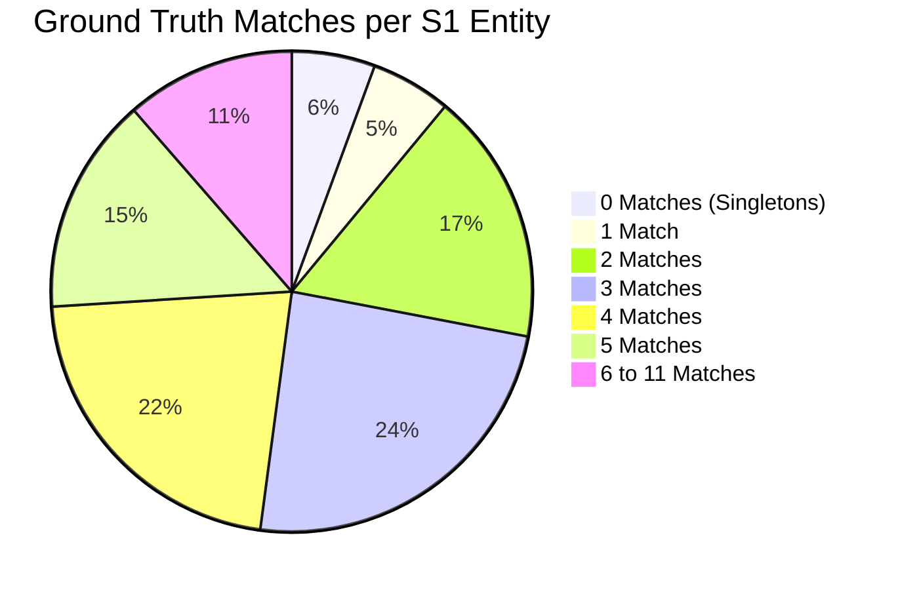

# Amazon ML Challenge 2026: Business Entity Resolution
## Comprehensive Project Analysis & Architectural Blueprint

---

## 1. Executive Summary & Problem Overview

The **Amazon ML Challenge 2026** focuses on large-scale **Business Entity Resolution (ER)** across multiple heterogeneous data sources. In commercial enterprise systems, business identity data originates from disparate, noisy sources without shared primary keys.

* **Primary Objective:** Given deduplicated reference records from **Source 1 (S1)**, identify all matching records from **Source 2 (S2)** and **Source 3 (S3)**.
* **Cardinality Multiplicity:** An S1 entity can match **0 records (singleton)**, **1 record**, or **multiple records** spanning S2 and S3.
* **Evaluation Metric:** Macro-averaged **$F_{0.5}$ Score** across all S1 entities:
  $$F_{0.5} = \frac{1.25 \times \text{Precision} \times \text{Recall}}{0.25 \times \text{Precision} + \text{Recall}}$$

> **Key Takeaway:** Precision is weighted **2× over Recall**. A false positive (merging two distinct businesses) penalizes the score drastically more than a false negative (missing a match). Correctly identifying singletons (empty match lists) earns full credit ($1.0$), while any false merge on a singleton yields an instant score of $0.0$.

---

## 2. Dataset Architecture & Empirical Statistics

An empirical audit of the complete training and test sets gives the following exact parameters:

### 2.1 File Inventory & Cardinality

| Split | File Name | Size (MB) | Total Rows | Country Distribution | Missing / Empty Addresses |
| :--- | :--- | :--- | :--- | :--- | :--- |
| **Train** | `train_source1.tsv` | 200.34 MB | **2,206,821** | US: 1,323,633 (59.99%)<br>India: 883,188 (40.01%) | 0 (0.00%) |
| **Train** | `train_source2.tsv` | 466.63 MB | **5,034,616** | US: 3,016,817 (59.92%)<br>India: 2,017,799 (40.08%) | 168,967 (3.35%) |
| **Train** | `train_source3.tsv` | 480.37 MB | **5,285,603** | US: 3,170,056 (59.98%)<br>India: 2,115,547 (40.02%) | 175,916 (3.33%) |
| **Train** | `train_ground_truth.tsv` | 121.13 MB | **2,206,821** | — | — |
| **Test** | `test_source1.tsv` | 166.91 MB | **1,732,544** | US: 663,106 (38.27%)<br>India: 809,986 (46.75%)<br>**France: 259,452 (14.98%)** | 0 (0.00%) |
| **Test** | `test_source2.tsv` | 485.86 MB | **4,887,273** | US: 1,871,330 (38.29%)<br>India: 2,312,565 (47.32%)<br>**France: 703,378 (14.39%)** | 129,408 (2.65%) |
| **Test** | `test_source3.tsv` | 482.56 MB | **5,082,316** | US: 1,945,701 (38.28%)<br>India: 2,405,000 (47.32%)<br>**France: 731,615 (14.40%)** | 136,098 (2.68%) |

---

### 2.2 Ground Truth Match Characteristics (Training Set)

* **Total True Matches:** **7,638,365** pairs across 2,206,821 S1 entities.
* **Average Matches per S1 Entity:** **3.4613** overall (**3.6660** among non-singletons).
* **Source Match Distribution:** S2 comprises **48.36%** (3,693,619 pairs) and S3 comprises **51.64%** (3,944,746 pairs).
* **Match Multiplicity Distribution:**
  * **0 matches (Singletons):** 123,247 (**5.58%**)
  * **1 match:** 119,157 (**5.40%**)
  * **2 matches:** 375,212 (**17.00%**)
  * **3 matches:** 530,841 (**24.05%**)
  * **4 matches:** 484,115 (**21.94%**)
  * **5 matches:** 321,957 (**14.59%**)
  * **6 matches:** 164,868 (**7.47%**)
  * **7 matches:** 63,968 (**2.90%**)
  * **8 matches:** 18,680 (**0.85%**)
  * **9 matches:** 4,205 (**0.19%**)
  * **10 matches:** 534 (**0.02%**)
  * **11 matches:** 37 (**0.00%**)



---

## 3. Key Empirical Findings & Structural Insights

### 3.1 100% Strict Country Partition Invariant
* Complete verification across all **7,638,365** ground truth pairs proved that **0 cross-country matches exist**.
* Entities in `US` strictly match records in `US`.
* Entities in `India` strictly match records in `India`.
* Entities in `France` strictly match records in `France`.
* **Architectural Decision:** We partition candidate blocking strictly by `country`. This shrinks pairwise comparison search space by over 50–70% immediately with zero loss of recall.

### 3.2 The France "Zero-Shot" Generalization Challenge
* `France` records exist **exclusively in the test set** (259,452 in S1, 703,378 in S2, 731,615 in S3) and **do not appear in training data**.
* **Implications for Modeling:**
  1. No hardcoded country-specific lookup lists (e.g. static US state lists or Indian city dictionaries without fallback).
  2. The text processing pipeline must handle French characters/diacritics (`é, è, ê, ç, à, î, ô, û, œ`), French postal formats (5-digit numeric codes like `75008`), and French road prefixes (`Rue`, `Avenue`, `Boulevard`, `Allée`, `Impasse`, `Cedex`).
  3. Feature representations must rely on domain-invariant similarity functions (token Jaccard, Levenshtein, fuzzy token sets, character n-gram cosine similarities).

### 3.3 Noise Taxonomy Discovered in Real Data

```
┌────────────────────────────────────────────────────────────────────────────────────────┐
│                                   NOISE TAXONOMY                                       │
├─────────────────────────┬───────────────────────────────┬──────────────────────────────┤
│ Name Variations         │ Address Variations            │ Cross-Lingual & Structural   │
├─────────────────────────┼───────────────────────────────┼──────────────────────────────┤
│ • Word-order inversions │ • State abbrev vs full name   │ • Devanagari / Hindi script  │
│   ("CLINIC PRODUCER     │   ("VA" vs "Virginia")        │   ("महाराष्ट्र", "हरियाणा") │
│    MUMBAI" vs "Mumbai   │ • Street abbrevs ("AVE"/      │ • Missing addresses (~3.3%   │
│    Producer Clinic")    │   "Avenue", "RD"/"Road")      │   in S2 & S3)                │
│ • Legal suffix swaps    │ • Unit / Flat / Landmark      │ • French accents / diacritics│
│   (Inc, Corp, Pvt Ltd)  │   noise ("DOOR NO 1", "Near   │ • Punctuation & symbols      │
│ • Domain names/DBA      │   SBI ATM", "PMB 9239")       │   (hyphens, brackets, & vs   │
│   ("siiainvestments.com"│ • Transposed address elements │   "and")                     │
│    vs "Siia Investments")│   (Pin before Street, etc.)   │                              │
└─────────────────────────┴───────────────────────────────┴──────────────────────────────┘
```

---

## 4. Competition Requirements & Submission Protocol

### 4.1 Output Files Required

1. **`output/matching_results.tsv`** (Scored on Leaderboard):
   * Columns: `source1_entity_id \t matched_entity_ids`
   * Every S1 entity in the test set must have exactly one row.
   * `matched_entity_ids` is comma-separated list of matching S2/S3 IDs, or empty for singletons.
   * No duplicate IDs, no self-matches (`S1-`), only valid test IDs.

2. **`output/candidate_pairs.tsv`** (Blocking Audit):
   * Columns: `source1_entity_id \t candidate_entity_ids`
   * Candidate set generated by the blocking stage before final classification.
   * Every matched ID in `matching_results.tsv` should be a subset of candidates in `candidate_pairs.tsv`.

3. **`validate_submission.py` Checker:**
   * Run command:
     ```bash
     python utils/validate_submission.py --matching output/matching_results.tsv --candidate output/candidate_pairs.tsv --test-dir dataset/test
     ```

### 4.2 Final Submission Zip Structure
```
<team_name>_submission.zip
├── output/
│   ├── matching_results.tsv
│   └── candidate_pairs.tsv
├── code/
│   └── business_entity_resolution/
│       ├── src/
│       ├── README.md
│       └── requirements.txt
└── Documentation_template.md
```

### 4.3 Key Competition Constraints
* ✅ Model license: Open-source MIT / Apache 2.0 with $\le 8\text{B}$ parameters.
* ❌ Strictly prohibited: External databases, commercial APIs, external web scraping, or online geocoding lookups.

---

## 5. End-to-End Solution Architecture

```mermaid
flowchart TD
    A[Raw S1, S2, S3 TSV Files] --> B[1. Text Cleaning & Normalization]
    B -->|Lowercasing, Legal Suffix Normalization, Diacritics, Address Standardizing| C[Standardized Entity Store]
    
    C --> D[2. Multi-Key High-Recall Blocking Stage]
    D -->|Country Partition + Name Tokens + Char N-Grams + MinHash LSH| E[candidate_pairs.tsv (Recall >= 98%)]
    
    E --> F[3. High-Dimensional Feature Extraction]
    F -->|Fuzzy String Ratios, Jaccard, Levenshtein, TF-IDF Cosine, Token Set Overlaps| G[Pairwise Feature Matrix]
    
    G --> H[4. Machine Learning Classifier & Ranker]
    H -->|LightGBM / CatBoost / XGBoost binary classification & pairwise ranking| I[Match Probability Scores]
    
    I --> J[5. Precision-Heavy Post-Processing & F0.5 Optimizer]
    J -->|Optimal F0.5 Threshold, Transitive Graph Consistency, Singleton Filtering| K[output/matching_results.tsv]
    
    K --> L[6. Submission Validation]
    E --> L
    L -->|utils/validate_submission.py| M[Verified Submission Package]
```

---

## 6. Execution Roadmap & Next Steps

```mermaid
gantt
    title Execution Roadmap
    dateFormat  X
    axisFormat Step %d
    section Phases
    Phase 1: Environment & Validation Framework : 0, 1
    Phase 2: Preprocessing & Inverted Index Blocking Engine : 1, 2
    Phase 3: High-Dimensional Feature Engineering : 2, 3
    Phase 4: ML Classifier Training & F0.5 Threshold Optimization : 3, 4
    Phase 5: Full Test Inference & Output Generation : 4, 5
    Phase 6: Submission Verification & Documentation : 5, 6
```

1. **Phase 1: Environment & Validation Harness**
   * Set up high-performance data processing libraries (`polars`, `pyarrow`, `scikit-learn`, `lightgbm`, `rapidfuzz`).
   * Create a fast 10% representative local validation split with an automated macro $F_{0.5}$ scorer.

2. **Phase 2: Preprocessing & High-Recall Multi-Index Blocking**
   * Build memory-efficient inverted indexes (Country + Token n-grams + First words + MinHash).
   * Evaluate blocking recall on validation data to achieve $>98\%$ recall ceiling with $\le 15\text{ candidates/entity}$.

3. **Phase 3: Feature Engineering Engine**
   * Extract comprehensive lexical, token-level, fuzzy, phonetical, and structural features across name and address.

4. **Phase 4: ML Model Training & Threshold Optimization**
   * Train LightGBM / CatBoost models with class imbalance weighting.
   * Calibrate probability threshold specifically on macro $F_{0.5}$ to heavily reward precision.

5. **Phase 5: Test Set Inference & Generation**
   * Streamline memory-efficient batched inference across the 1.73M test S1 entities.
   * Generate `output/candidate_pairs.tsv` and `output/matching_results.tsv`.

6. **Phase 6: Verification & Final Package Preparation**
   * Run `validate_submission.py` to ensure complete compliance.
   * Fill out `Documentation_template.md` and build the final submission zip.
